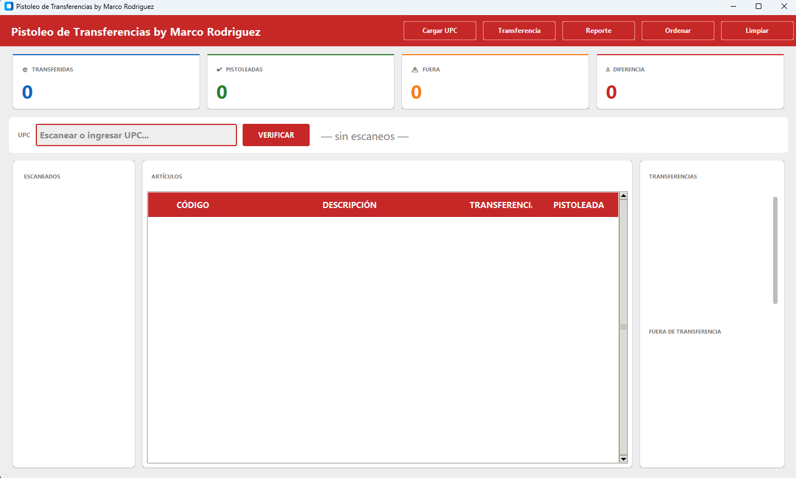
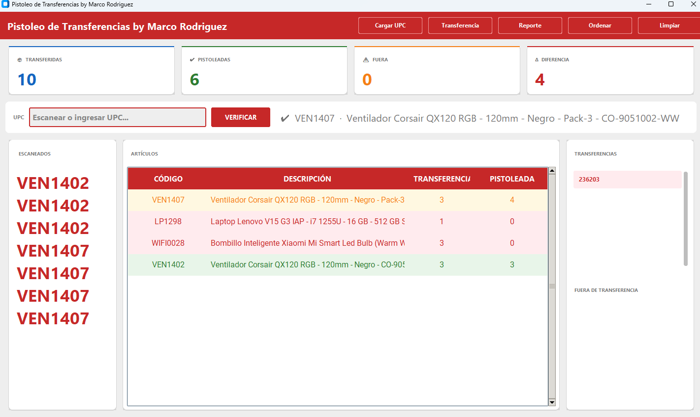

# 🔫 Sistema de Pistoleo de Transferencias

Sistema de escritorio para verificar y controlar transferencias de inventario mediante escaneo de códigos UPC. Desarrollado en Python con arquitectura MVC.

---

## 📋 Descripción

Esta aplicación permite a los operadores de bodega escanear artículos de una transferencia y verificar en tiempo real si cada artículo escaneado corresponde a la transferencia cargada, mostrando diferencias, faltantes y sobrantes de forma visual e inmediata.

### Funcionalidades principales

- Carga de archivos UPC desde Excel
- Carga de una o múltiples transferencias simultáneas
- Escaneo de UPC con validación en tiempo real
- Indicadores visuales por color (completo, faltante, sobrante, fuera de transferencia)
- Contadores en vivo de unidades transferidas, pistoleadas, fuera de transferencia y diferencia
- Exportación de reporte en Excel con formato y colores
- Ordenamiento de artículos por estado
- Limpieza total del sistema

---

## 📸 Capturas de pantalla




```
docs/
└── screenshots/
    ├── dashboard.png
    ├── escaneando.png
    └── reporte.png
```

---

## 🚀 Instalación

### Requisitos

- Python 3.10 o superior
- pip

### Pasos

**1. Clona el repositorio**

```bash
git clone https://github.com/tu-usuario/pistoleo-v2.git
cd pistoleo-v2
```

**2. Crea un entorno virtual (recomendado)**

```bash
python -m venv venv
venv\Scripts\activate        # Windows
source venv/bin/activate     # Mac / Linux
```

**3. Instala las dependencias**

```bash
pip install -r requirements.txt
```

**4. Ejecuta la aplicación**

```bash
python main.py
```

### Dependencias (`requirements.txt`)

```
customtkinter
pandas
openpyxl
pillow
```

---

## 📖 Cómo usar la app

### 1. Cargar UPC

Presiona **Cargar UPC** y selecciona el archivo Excel con los códigos UPC.

El archivo debe tener exactamente 3 columnas sin encabezado:

| Columna A | Columna B       | Columna C   |
|-----------|-----------------|-------------|
| UPC       | Código producto | Descripción |

### 2. Cargar Transferencia

Presiona **Cargar Transferencia** y selecciona el archivo Excel de la transferencia.

El archivo debe tener encabezados con estos nombres exactos:

| Producto | Descripción | Cantidad |
|----------|-------------|----------|
| CAB0101  | Cable HDMI  | 10       |

Puedes cargar **múltiples transferencias** al mismo tiempo — el sistema las acumula. Para eliminar una, haz clic en su botón en el panel derecho.

### 3. Escanear artículos

Coloca el cursor en el campo **UPC**, escanea con la pistola o escribe manualmente y presiona **Enter** o el botón **Verificar**.

El artículo aparecerá en la tabla con uno de estos estados:

| Color    | Significado                              |
|----------|------------------------------------------|
| 🟢 Verde  | Cantidad pistoleada coincide             |
| 🔴 Rojo   | Faltan unidades por pistolar             |
| 🟡 Amarillo | Se pistolearon más unidades de las esperadas |
| 🔵 Azul   | Artículo fuera de transferencia          |

### 4. Exportar reporte

Presiona **Reporte**, elige dónde guardar el archivo y obtendrás un Excel con todos los artículos, sus cantidades y estado.

### 5. Ordenar

Presiona **Ordenar** para agrupar los artículos por estado: fuera de transferencia → sobrantes → faltantes → completos.

### 6. Limpiar

Presiona **Limpiar** para reiniciar completamente el sistema y comenzar una nueva sesión.

---

## 🏗 Arquitectura

El proyecto sigue el patrón **MVC (Model - View - Controller)**:

```
pistoleo-v2/
├── main.py                          # Punto de entrada
├── app/
│   ├── models/
│   │   └── transferencia_model.py  # Acceso a la base de datos (SQLite)
│   ├── controllers/
│   │   └── pistoleo_controller.py  # Lógica de negocio
│   └── views/
│       └── main_view.py            # Interfaz gráfica (CustomTkinter)
├── data/
│   └── transferencias/             # Base de datos SQLite
└── requirements.txt
```

---

## 👨‍💻 Autor

Desarrollado por **Marco Rodriguez**  


---

